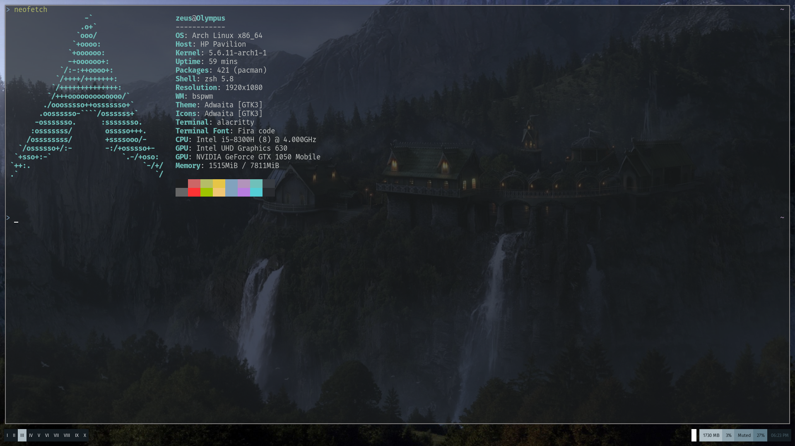

# dotfiles

My dotfiles for Arch
## Applications
Applications I usually install on a minimal Arch setup. Yours could be different, but you'll find config files for many of these applications here. Feel free to use them if you'd like. 
- bspwm with sxhkd
- NetworkManager
- Polybar
- Alacritty
- Chromium
- VSCode
- Picom
- zsh
- oh my zsh (typewriter theme)

### Fonts
- Fira code for the terminal
- Fira sans and monospace
- Iosevka for VSCode terminal
- Polybar fonts
